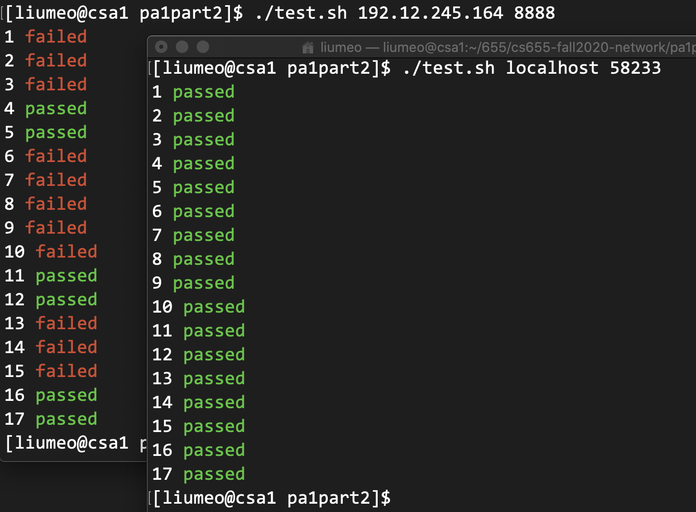

* Qijia Liu
* Weifan Chen
# Part 1
## Design
* We use Python in both client and server. There's a `util.py` that encapsulates function `sendall` and `recv` of the builtin `socket` package which handle byte arrays, to deal with strings. The `util.py` is also capable of processing command line arguments:
```
[liumeo@csa1 pa1part1]$ python3 client.py localhost
usage: client.py [-h] host port
client.py: error: the following arguments are required: port
```
* To support ending with '\n', we set the buffer size of `recv` to 1 and stop receiving when there is no more byte or we meet '\n'. For the sake of performance, we convert byte array to string when we finish receiving, rather than do it in per-byte manner.
* Although CPython has GIL, for an I/O bound application like this, it's still worth using multithreading to process requests simultaneously (as shown below). Every time the main thread accepts a request, it creates a new thread to handle the request so that it can still accept new requests.
```
[liumeo@csa1 pa1part1]$ python3 server.py 58233
Connected by ('127.0.0.1', 44696)
Connected by ('127.0.0.1', 44698)
Connection ('127.0.0.1', 44696) closed
Connection ('127.0.0.1', 44698) closed
```
## Test
* To start server on csa1, choose a port (here 58233) and run `python3 server.py 58233`.
* To start client on csa1 or other devices, run:
```
[liumeo@csa1 pa1part1]$ python3 client.py csa1.bu.edu 58233
hello world!
hello world!
[liumeo@csa1 pa1part1]$
```
* Type some text (here "hello world!") on the client and press Enter, the server will echo the text. The client prints what it receives and closes the connection.
<div style="page-break-after: always;"></div>

# Part 2
## Design
* We follow the design of Part 1 with `util.py` and multithreading, so no need to repeat that stuff.
* Message validation is separated from request processing, which makes the code more readable.
* We implement more accurate validation than the provided test servers.
## Test
* To start server on csa1, choose a port (here 58233) and run `python3 server.py 58233`.
* To start client on csa1 or other devices, run `python3 client.py csa1.bu.edu 58233`
* We also implement a shell script `test.sh` to check whether `server.py` works correctly under different requests. We come up with some testcases (stored in `testcases`). To test any server, run `sh test.sh <Address> <Port>`. Below is the result of our server and the provided test server. As we can see, we passed all testcases, but the provided server failed some cases.

