* Qijia Liu (U19831657) mainly writes SR part
* Weifan Chen (U51902184) mainly writes GBN part
# Selective Repeat
## Design
* We use C++ to implement the SR.

### Sender A

**Message/retransmission buffer**: Everytime when layer 5 uses the service, a packet would be created, as the seqence number could be determined right away. No matter whether the sender window still has space or not, the packet would be enqued into a packet deque. The logical sender window size is maintained by the base sender window index. Given a base index and the window size, the packets in the logical sender window could be identified. As a consequence, packets not in the logical window are the 'buffered message'. The buffer and the sequence number of the first packet in the buffer are declared as `deque<pkt> A_queue` and `unsigned first_unacked`. 

**Checksum calculation**: The calculation of the `get_checksum` is done by viewing a packet as a sequence of bytes, adding them up, and keeping only the least 8 significant bits. Prior to the checksum calculation, the checksum field in the packet is initialized to be zero as defined in `make_pkt`, and would be assigned to the complement of the return of the checksum function. By doing so, on the receiver side, the validation could be compared with the return value of the checksum function and 0xFF. 

**A_input**: Upon a successful reception of a packet, the difference between the acknowledgement number and the sender window base number, could tell how many indices the window could advance, and pop the packets in the buffer accordingly. With the new base index, the sender would also send the packets newly fallen into the logical window range if any. As the base index is adjusted based on reception information, any duplicated ACK nubmers would not be larger than the base index, thus retransmission can be performed.

**A_timerinterrupt**: Given the A_input implementation, upon a timer goes off, the packet at the front of the deque would be sent, as it is the first unacked packet in the sender window.

### Receiver B

**Receiver window**: The Receiver window is represented by a fixed-size circular buffer of two fields `vector<pair<bool, char[20]>> B_window`. The second is the messaged carried in the packet, and the first field is a boolean indicating whether the current index of the window has already buffered a message or not. As the base index (the next expected seqno) is changing, it's important to have a variable `next_expected_index` to indicate which index is used as the base of the receiver window. By doing so, upon B successfully received a packet, an offset could be calculated, and buffer the message into the correct place, and marked it as buffered. If the packet is the next expected packet by the reciever, advance the `next_expected_index` by 1 as well, and mark the delivered index as unbuffered, then it is used as the tail of the receiver buffer window. If the new `B_window[next_expected_index]` contains a buffered message, deliver it and go on.

### Tradeoffs & Extensions
At first we tried C. But we didn't want to discard packets that fell out of the sender's buffer. Nor did we want to implement a dynamically growing buffer because it was error-prune, and we would have to spend lots of time distinguishing data-structure error and network algorithm error. It counldn't be easily shrinked either, when ACKs were received.

So we choosed `deque` provided by C++ STL, which supports O(1) push/pop at front (for ACKed packets) and end (for new packets to send), plus random access (for new packets that fall into the window). Moreover, the space cost is linear. So we can say we achieved best performance in data structure (given that out-of-buffer packets are all preserved).

## Test & Statistics

### Stat collection and trace 

An instance of `struct statistics` is dedicated to store all the statistical information. Since the simulation is built upon event, `collect_stat` could take appropriate action based upon the event type parameter. It would also write to the statistic instance.

What's worth mentioned is that there's a boolean variable to indicate whether A is in error state (duplicate ACK, timeout). That's used because RTT is only valid when A is in normal state.

`print_message` would handle some of the trace print based upon the event type. As the type traces varies a lot, some trace prints are directly done in the corresponding rountine without invoking `print_message`. 

### Compile & run
`make`, then `./pa2`. To run with the given sample, `make test`.

## Experiment 

`experiment.sh` can run a range of randome seeds with loss/corrupt probability increases, and output the experiment statistics to a file. `plot.py` can read the generated stat file and do the ploting, also output `confidence_interval` as well. To reproduce our experiment, do
```sh
# python3 -m pip install numpy pandas seaborn --user # if needed
make draw
```
### About retransmission timeout

As the single-way delay is on average 5, we choose 15 as the static retransmission timer value when performing the experiment, which seems to work properly.

### Experiment setup

Exp | Loss Prob. | Corrupt Prob. | Num of messages | avg. time from layer5 | Window size | Retrans. timeout | Random Seed
--------| --------|----|--------|--------|---------|--------|---------|
trace | 0.1 | 0.1 | 1000 | 200 | 8 | 30 | 1234 | 
trace0 | 0 | 0 | 1000 | 200 | 8 | 20 | 1234
trace1 | 0 | 0 | 1000 | 200 | 8 | 15 | 1234
exp1| 0~0.9 | 0.1 | 100 | 200 | 8 | 15 | 1000~1019|
exp2 | 0.1 | 0~0.9 | 100 | 200 | 8 | 15 | 1000~1019|

For exp1 and exp2, for each value of the error probability, 20 random seeds would be run to obtain statistically meaningful results. 

**statistical result for trace**

Num of original packets transmitted | Num of retransmissions | Num of packets delivered to layer 5 | Num of ACK packets sent| Num of corrupted packets| Ratio of exps | lost packets | Ratio of corrupted packets |Average RTT|Average communication time|
|----|-----|------|-----|-----|-----|-----|-----|-----|-----|
trace | 1000  | 487 | 1000 | 1216 | 227| 0.0961894 | 0.0929185| 10.8078 | 26.1019|
trace0 | 1000 | 0 | 1000 | 1000 | 0 | 0 | 0 | 10.7616 | 10.7616
trace1 | 1000 | 122 | 1000 | 1122 | 0 | 0.0543672 | 0 | 9.95358 | 10.795

### Experiment plot

All pairs of plots are derived from exp1 and epx2. Each data point is generated by 20 experiements with random seed 1000~1019. We also provide a complete list of confidence intervals at the end of the document. 

### Experiment plot 

||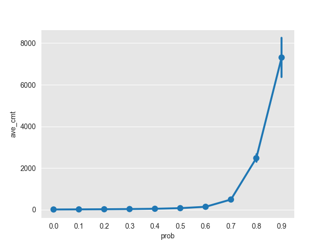
|:--:|:--:|
| *Loss Prob. vs com. time on 20 random seeds* |*Corrupt Prob. vs com. time on 20 random seeds* |

|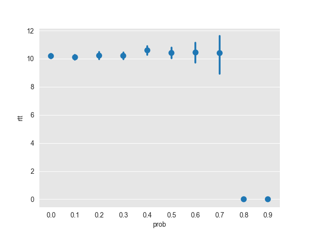|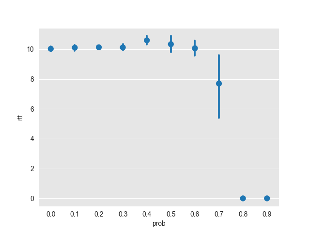
|:--:|:--:|
| *Loss Prob. vs rtt on 20 random seeds. Missing field due to no eligible packet to track for RTT* |*Corrupt Prob. vs rtt on 20 random seeds. Missing field due to no eligible packet to track for RTT* |

||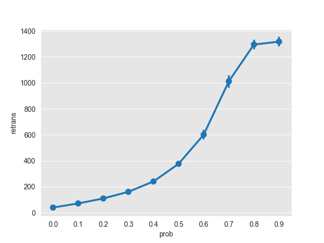
|:--:|:--:|
| *Loss Prob. vs retrans on 20 random seeds* |*Corrupt Prob. vs retrans on 20 random seeds* |

||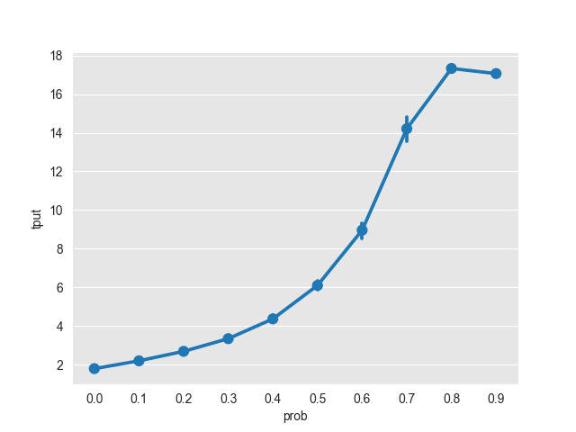
|:--:|:--:|
| *Loss Prob. vs tput on 20 random seeds* |*Corrupt Prob. vs tput on 20 random seeds* |

|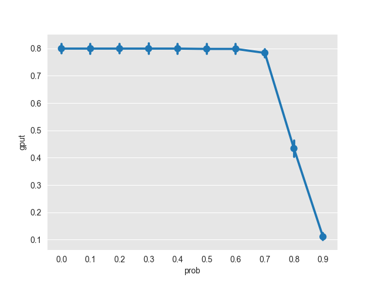|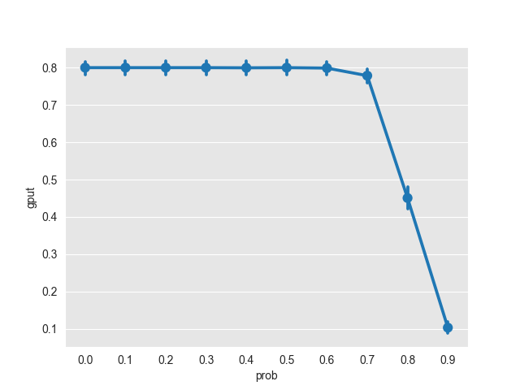
|:--:|:--:|
| *Loss Prob. vs gput on 20 random seeds* |*Corrupt Prob. vs gput on 20 random seeds* |

### Confidence Interval for average communication time

P|loss case 95% interval|corrupt case 95 % interval |
-|------------------|-------------------|
0.0|(14.66, 15.22)|(14.56, 15.09)
0.1|(19.38, 20.31)|(19.38, 20.31)
0.2|(25.51, 27.03)|(25.25, 26.75)
0.3|(34.23, 37.34)|(33.75, 35.94)
0.4|(47.40, 52.38)|(46.83, 51.17)
0.5|(73.67, 82.70)|(74.14, 82.67)
0.6|(131.34, 159.71)|(132.15, 155.17)
0.7|(376.27, 572.66)|(408.06, 577.71)
0.8|(2352.19, 2750.03)|(2306.46, 2647.38)
0.9|(6585.79, 8340.20)|(6297.37, 8320.58)

# GBN with SACK

## Design
* We extends our SR implementation to finish GBN, so here we focus on differences only. These can also be shown using `diff` command easily.

### Sender A

**Message/retransmission buffer**: We add a boolean field to `A_queue` to show whether a packet is SACKed.

**A_input**: Add steps that A flags SACKed packets. And on duplicate ACK, retransmit all unSACKed packets.

**A_timerinterrupt**: On timeout, retransmit all unSACKed packets.

### Receiver B

**B_input**: When sending ACK, carry the sequence number of the first (up to) 5 received packets after the sequence number of the next expected packet.

### Simulator
Simulator is modified a bit to adapt to new sack field in the packet.

### Compile & run
Same with SR.

## Test & Statistics

For communication time, as we should take SACK into consideration, we stores the negative time of every packet in the `A_queue`. Thus when receiving SACK, the sign of the time can tell whether it's already SACKed. For newly ACKed packet, we add current time to it making it positive.

## Experiment

The experiments are conducted with the same parameters. As we can see, GBN indeed retransmits more packets compared with SR under the same setting.
Exp | Loss Prob. | Corrupt Prob. | Num of messages | avg. time from layer5 | Window size | Retrans. timeout | Random Seed
--------| --------|----|--------|--------|---------|--------|---------|
trace | 0.1 | 0.1 | 1000 | 200 | 8 | 30 | 1234 | 
trace0 | 0 | 0 | 1000 | 200 | 8 | 20 | 1234
trace1 | 0 | 0 | 1000 | 200 | 8 | 15 | 1234
exp1| 0~0.9 | 0.1 | 100 | 200 | 8 | 15 | 1000~1019|
exp2 | 0.1 | 0~0.9 | 100 | 200 | 8 | 15 | 1000~1019|

**statistical result for trace**

Num of original packets transmitted | Num of retransmissions | Num of packets delivered to layer 5 | Num of ACK packets sent| Num of corrupted packets| Ratio of Exp | lost packets | Ratio of corrupted packets |Average RTT|Average communication time|
|-----| -----|------|-----|-----|-----|-----|-----|-----|-----|
trace | 1000 | 535 | 1000 | 1243 | 252 | 0.101872 | 0.101002 | 10.9825 | 26.5356
trace0 | 1000 | 0 | 1000 | 1000 | 0 | 0 | 0 | 10.7616 | 10.7616
trace1 | 1000 | 136 | 1000 | 1136 | 0 | 0.05985 | 0 | 9.93833 | 10.8192


### Experiment plot

All pairs of plots are derived from exp1 and epx2. Each data point is generated by 20 experiements with random seed 1000~1019. We also provide a complete list of confidence intervals at the end of the document. 

|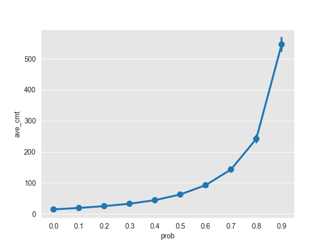|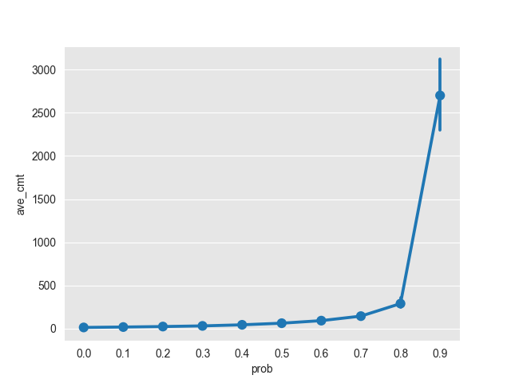
|:--:|:--:|
| *Loss Prob. vs com. time on 20 random seeds* |*Corrupt Prob. vs com. time on 20 random seeds* |

|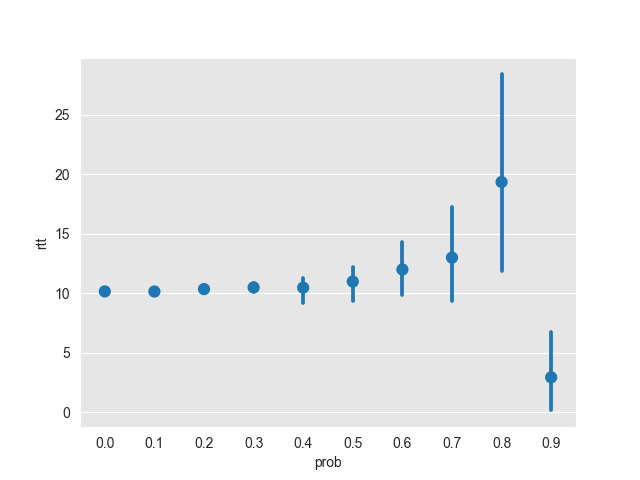|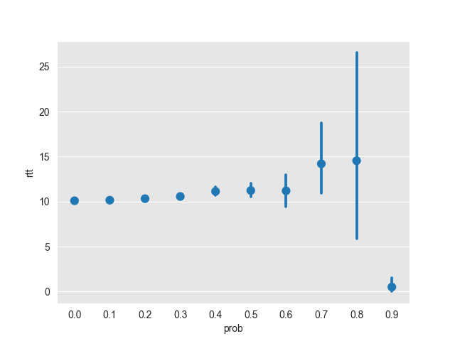
|:--:|:--:|
| *Loss Prob. vs rtt on 20 random seeds. Missing field due to no eligible packet to track for RTT* |*Corrupt Prob. vs rtt on 20 random seeds. Missing field due to no eligible packet to track for RTT* |

||
|:--:|:--:|
| *Loss Prob. vs retrans on 20 random seeds* |*Corrupt Prob. vs retrans on 20 random seeds* |

||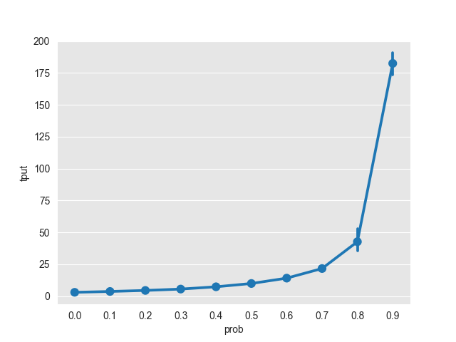
|:--:|:--:|
| *Loss Prob. vs tput on 20 random seeds* |*Corrupt Prob. vs tput on 20 random seeds* |

||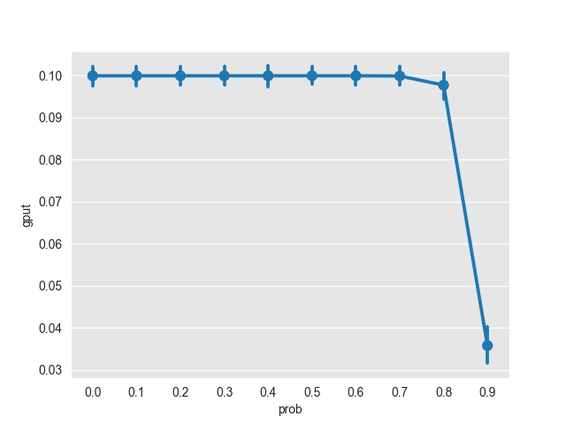
|:--:|:--:|
| *Loss Prob. vs gput on 20 random seeds* |*Corrupt Prob. vs gput on 20 random seeds* |


### Confidence Interval for average communication time

P|loss case 95% interval|corrupt case 95 % interval |
-|------------------|-------------------|
0.0|(14.57, 15.12)|(14.54, 15.04)
0.1|(19.16, 19.95)|(19.16, 19.95)
0.2|(24.70, 26.04)|(24.54, 25.97)
0.3|(32.06, 34.31)|(31.88, 33.51)
0.4|(42.92, 46.08)|(43.90, 46.93)
0.5|(60.85, 64.86)|(61.58, 66.42)
0.6|(88.72, 96.88)|(89.46, 97.69)
0.7|(138.23, 148.54)|(139.37, 152.23)
0.8|(230.10, 254.15)|(233.39, 348.21)
0.9|(524.41, 567.68)|(2268.77, 3130.47)


# Discussion

## GBN has faster error recovery than SR
When the loss and corruption probability are low, SR and GBN exhibit similar performance (throughput, goodput, packet delay). However as the probability increases, their performance diverge. For high probability, GBN with SACK implementation has over 10 times shorter average communication times compared with its counterpart in handling the loss, and has half average communciation time compared with the counterpart in handling packet corruption. Meanwhile, as their goodput seem similar, GBN's throughput is much higher. These differences are expected, as for SR the exception recovery mechanism can only work with one packet at a time, this is not scalable for larger error probability. GBN on the other hand keeps sending unacked packet upon receving duplicate ACK or timeout, although seems wasteful, it decreases delay.

## Corruption and Loss rate have different impact on GBN

Notice in our GBN for large error probability, the performance in loss case is still significantly better than in corruption case. This is due to the corrupt packet would still use the bandwidth of the channel, and the channel would be 'garbaged' thus long transmission time. If the packet is lost, the utilization of the channel would be low, thus faster transmission. The simulation environment does capture this behavior. 

```
lastime = time_now;
    /* for (q=evlist; q!=NULL && q->next!=NULL; q = q->next) */
    for (q = evlist; q != NULL; q = q->next)
        if ((q->evtype == FROM_LAYER3 && q->eventity == evptr->eventity))
            lastime = q->evtime;
    evptr->evtime = lastime + 1 + 9 * mrand(2);
```
The arrival time is calculated based on the arrival time of the packets in front of the packet being calculated. Thus a crowded channel would produce a higher communication time. 
# Supplement Materials
* On the original PA2.pdf, we only need to compute confidence interval for communication time, however later on Piazza we are required to compute for all stats. So we add all intervals here. Followed by 5 cases of the trace for SR and 5 cases of the trace for GBN.
```
SR corruption vs communication time
0.0 ('14.56', '15.09')
0.1 ('19.38', '20.31')
0.2 ('25.25', '26.75')
0.3 ('33.75', '35.94')
0.4 ('46.83', '51.17')
0.5 ('74.14', '82.67')
0.6 ('132.15', '155.17')
0.7 ('405.86', '579.91')
0.8 ('2306.46', '2647.38')
0.9 ('6297.37', '8320.58')
SR loss vs communication time
0.0 ('14.66', '15.22')
0.1 ('19.38', '20.31')
0.2 ('25.51', '27.03')
0.3 ('34.23', '37.34')
0.4 ('47.40', '52.38')
0.5 ('73.67', '82.70')
0.6 ('131.34', '159.71')
0.7 ('376.27', '572.66')
0.8 ('2352.19', '2750.03')
0.9 ('6585.79', '8340.20')
SR loss vs RTT
0.0 ('10.03', '10.35')
0.1 ('9.92', '10.29')
0.2 ('9.95', '10.50')
0.3 ('9.97', '10.45')
0.4 ('10.28', '10.92')
0.5 ('10.01', '10.82')
0.6 ('9.74', '11.15')
0.7 ('9.00', '11.80')
0.8 ('0.00', '0.00')
0.9 ('0.00', '0.00')
SR corrupt vs RTT
0.0 ('9.86', '10.20')
0.1 ('9.92', '10.29')
0.2 ('9.99', '10.26')
0.3 ('9.89', '10.34')
0.4 ('10.29', '10.90')
0.5 ('9.80', '10.87')
0.6 ('9.51', '10.61')
0.7 ('5.52', '9.87')
0.8 ('0.00', '0.00')
0.9 ('0.00', '0.00')
SR loss vs num retransmission
0.0 ('37.86', '43.14')
0.1 ('69.03', '74.77')
0.2 ('106.84', '116.16')
0.3 ('155.71', '170.49')
0.4 ('230.50', '254.10')
0.5 ('366.17', '397.33')
0.6 ('563.88', '625.52')
0.7 ('958.59', '1050.81')
0.8 ('1265.07', '1322.93')
0.9 ('1285.30', '1349.20')
SR corrupt vs num retransmission
0.0 ('38.29', '42.31')
0.1 ('69.03', '74.77')
0.2 ('105.59', '114.81')
0.3 ('155.37', '167.13')
0.4 ('231.43', '250.77')
0.5 ('360.70', '393.20')
0.6 ('568.62', '634.08')
0.7 ('965.40', '1058.80')
0.8 ('1262.81', '1327.39')
0.9 ('1285.51', '1349.19')
SR loss vs tput
0.0 ('1.09', '1.15')
0.1 ('1.34', '1.41')
0.2 ('1.64', '1.74')
0.3 ('2.02', '2.18')
0.4 ('2.62', '2.86')
0.5 ('3.69', '4.02')
0.6 ('5.26', '5.86')
0.7 ('8.45', '9.19')
0.8 ('10.76', '10.85')
0.9 ('10.63', '10.70')
SR corrupt vs tput
0.0 ('1.10', '1.15')
0.1 ('1.34', '1.41')
0.2 ('1.63', '1.73')
0.3 ('2.01', '2.17')
0.4 ('2.61', '2.85')
0.5 ('3.65', '3.97')
0.6 ('5.34', '5.86')
0.7 ('8.48', '9.28')
0.8 ('10.78', '10.88')
0.9 ('10.63', '10.70')
SR loss vs gput
0.0 ('0.78', '0.82')
0.1 ('0.78', '0.82')
0.2 ('0.78', '0.82')
0.3 ('0.78', '0.82')
0.4 ('0.78', '0.82')
0.5 ('0.78', '0.82')
0.6 ('0.78', '0.82')
0.7 ('0.77', '0.80')
0.8 ('0.40', '0.46')
0.9 ('0.10', '0.12')
SR corrupt vs gput
0.0 ('0.78', '0.82')
0.1 ('0.78', '0.82')
0.2 ('0.78', '0.82')
0.3 ('0.78', '0.82')
0.4 ('0.78', '0.82')
0.5 ('0.78', '0.82')
0.6 ('0.78', '0.82')
0.7 ('0.76', '0.80')
0.8 ('0.42', '0.48')
0.9 ('0.09', '0.12')
```
```
GBN corruption vs communication time
0.0 ('14.54', '15.04')
0.1 ('19.16', '19.95')
0.2 ('24.54', '25.97')
0.3 ('31.88', '33.51')
0.4 ('43.90', '46.93')
0.5 ('61.58', '66.42')
0.6 ('89.46', '97.69')
0.7 ('139.37', '152.23')
0.8 ('233.39', '348.21')
0.9 ('2268.77', '3130.47')
GBN loss vs communication time
0.0 ('14.57', '15.12')
0.1 ('19.16', '19.95')
0.2 ('24.70', '26.04')
0.3 ('32.06', '34.31')
0.4 ('42.92', '46.08')
0.5 ('60.85', '64.86')
0.6 ('88.72', '96.88')
0.7 ('138.23', '148.54')
0.8 ('230.10', '254.15')
0.9 ('524.41', '567.68')
GBN loss vs RTT
0.0 ('10.00', '10.32')
0.1 ('9.92', '10.39')
0.2 ('10.04', '10.67')
0.3 ('10.13', '10.86')
0.4 ('10.57', '11.37')
0.5 ('10.79', '12.75')
0.6 ('10.74', '14.76')
0.7 ('12.66', '25.02')
0.8 ('13.15', '35.67')
0.9 ('-0.41', '6.31')
GBN corrupt vs RTT
0.0 ('9.91', '10.28')
0.1 ('9.92', '10.39')
0.2 ('10.07', '10.59')
0.3 ('10.26', '10.88')
0.4 ('10.64', '11.63')
0.5 ('10.36', '12.11')
0.6 ('10.52', '13.66')
0.7 ('9.37', '30.89')
0.8 ('3.94', '25.15')
0.9 ('-293.95', '908.52')
GBN loss vs num retransmission
0.0 ('38.73', '44.27')
0.1 ('71.04', '77.56')
0.2 ('108.39', '117.71')
0.3 ('159.85', '174.75')
0.4 ('231.85', '253.45')
0.5 ('354.36', '381.64')
0.6 ('546.00', '601.50')
0.7 ('883.45', '953.35')
0.8 ('1503.08', '1664.42')
0.9 ('3444.88', '3717.82')
GBN corrupt vs num retransmission
0.0 ('39.81', '44.29')
0.1 ('71.04', '77.56')
0.2 ('108.13', '117.47')
0.3 ('158.31', '170.29')
0.4 ('240.33', '259.97')
0.5 ('358.75', '391.75')
0.6 ('548.79', '606.01')
0.7 ('894.71', '984.19')
0.8 ('1543.11', '2359.59')
0.9 ('8334.89', '9155.01')
GBN loss vs tput
0.0 ('2.85', '3.03')
0.1 ('3.52', '3.73')
0.2 ('4.29', '4.57')
0.3 ('5.35', '5.77')
0.4 ('6.85', '7.40')
0.5 ('9.33', '10.14')
0.6 ('13.31', '14.73')
0.7 ('20.37', '21.93')
0.8 ('33.18', '36.76')
0.9 ('72.91', '80.25')
GBN corrupt vs tput
0.0 ('2.87', '3.03')
0.1 ('3.52', '3.73')
0.2 ('4.28', '4.56')
0.3 ('5.31', '5.69')
0.4 ('6.98', '7.60')
0.5 ('9.48', '10.26')
0.6 ('13.43', '14.71')
0.7 ('20.51', '22.72')
0.8 ('34.14', '51.15')
0.9 ('173.88', '191.18')
GBN loss vs gput
0.0 ('0.10', '0.10')
0.1 ('0.10', '0.10')
0.2 ('0.10', '0.10')
0.3 ('0.10', '0.10')
0.4 ('0.10', '0.10')
0.5 ('0.10', '0.10')
0.6 ('0.10', '0.10')
0.7 ('0.10', '0.10')
0.8 ('0.10', '0.10')
0.9 ('0.10', '0.10')
GBN corrupt vs gput
0.0 ('0.10', '0.10')
0.1 ('0.10', '0.10')
0.2 ('0.10', '0.10')
0.3 ('0.10', '0.10')
0.4 ('0.10', '0.10')
0.5 ('0.10', '0.10')
0.6 ('0.10', '0.10')
0.7 ('0.10', '0.10')
0.8 ('0.09', '0.10')
0.9 ('0.03', '0.04')
```
