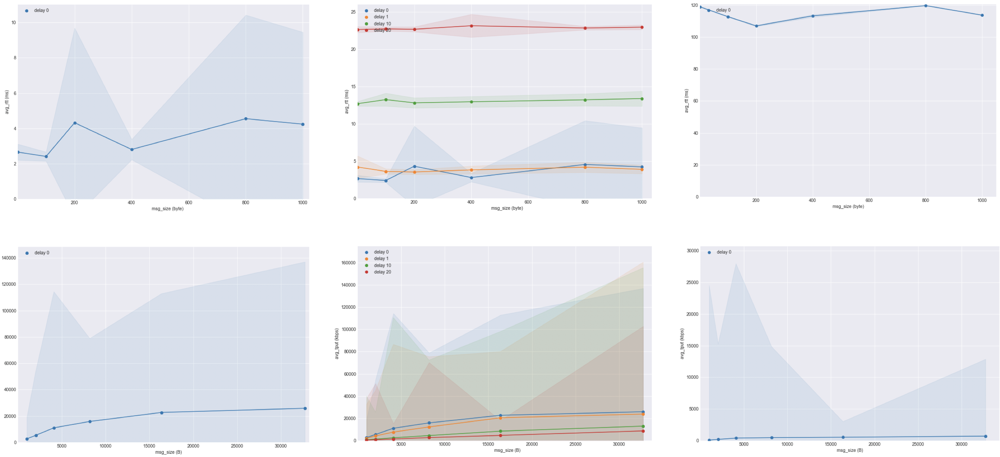

* Qijia Liu (U19831657)
* Weifan Chen (U51902184)
# Part 1
## Design
* We use Python in both client and server. There's a `util.py` that encapsulates function `sendall` and `recv` of the builtin `socket` package which handle byte arrays, to deal with strings. The `util.py` is also capable of processing command line arguments:
```
[liumeo@csa1 pa1part1]$ python3 client.py localhost
usage: client.py [-h] host port
client.py: error: the following arguments are required: port
```
* To support ending with '\n', we set the buffer size of `recv` to 1 and stop receiving when there is no more byte or we meet '\n'. For the sake of performance, we convert byte array to string when we finish receiving, rather than do it in per-byte manner.
* Although CPython has GIL, for an I/O bound application like this, it's still worth using multithreading to process requests simultaneously (as shown below). Every time the main thread accepts a request, it creates a new thread to handle the request so that it can still accept new requests.
```
[liumeo@csa1 pa1part1]$ python3 server.py 58233
Connected by ('127.0.0.1', 44696)
Connected by ('127.0.0.1', 44698)
Connection ('127.0.0.1', 44696) closed
Connection ('127.0.0.1', 44698) closed
```
## Test
* To start server on csa1, choose a port (here 58233) and run `python3 server.py 58233`.
* To start client on csa1 or other devices, run:
```
[liumeo@csa1 pa1part1]$ python3 client.py csa1.bu.edu 58233
hello world!
hello world!
[liumeo@csa1 pa1part1]$
```
* Type some text (here "hello world!") on the client and press Enter, the server will echo the text. The client prints what it receives and closes the connection.
<div style="page-break-after: always;"></div>

# Part 2
## Design
* We follow the design of Part 1 with `util.py` and multithreading, so no need to repeat that stuff.
* Message validation is separated from request processing, which makes the code more readable.
* We implement more accurate validation than the provided test servers.
## Test
* To start server on csa1, choose a port (here 58233) and run `python3 server.py 58233`.
* To start client on csa1 or other devices, first install `tqdm` by `python3 -m pip install tqdm --user`, then run `python3 client.py csa1.bu.edu 58233`.
* To generate plots, first install `seaborn` on the client machine by `python3 -m pip install seaborn --user`, then run `python3 plot.py`.
* We also implement a shell script `test.sh` to check whether `server.py` works correctly under different requests. We come up with some testcases (stored in `testcases`). To test any server, run `bash test.sh <Address> <Port>`. Below is the result of our server and the provided test server. As we can see, we passed all testcases, but the provided server failed some cases.

## Environment
Experiment|Message size(byte)|Delay(ms)|Probes|Client|Server
-|-|-|-|-|-
RTT1|1,100,200,400,800,1000|0,1,10,20,50,100|15|Local|csa1
TPUT1|1K,2K,4K,8K,16K,32K|0,1,10,20,50,100|15|Local|csa1
RTT2|1,100,200,400,800,1000|0,1,10,20,50,100|15|csa1|Test Server
TPUT2|1K,2K,4K,8K,16K,32K|0,1,10,20,50,100|15|csa1|Test Server
* Local: macOS (Darwin 19.4.0)
* csa1: CentOS (Linux 3.10.0-1127.18.2.el7.x86_64)
* Test Server: unknown, 128.206.119.42:8888
## Result

Fig 1: RTT1, Fig 2: RTT1 (multiple delays), Fig 3: RTT2  
Fig 4: TPUT1, Fig 5: TPUT1 (multiple delays), Fig 6: TPUT2  
## Explanation
### RTT
For a given delay, the shape of the trend line is nearly a horizontal line with small variance. As message size increases, there is no significant change in average rtt measurement (Fig 1). As the delay parameter increases, the overall line would shift up and maintain the "flat" shape (Fig 2). This trend also appears on test server (Fig 3).  
Theoretically we expect the RTT increases as the message size increases given a fixed delay. However, no such phenomana were observed because the bandwith is way more sufficient compared with the message size we probed (1B to 1KB). As the delay increases, RTT would merely need to add the costant delay factor, but all other parts remains the same, which explains the overall shift-up of the lines.
### Throughput
For a given delay parameter, the tput increases as the message size increases. The curve exhibits concave down increasing pattern (Fig 4). As deley parameter increases, the curve would preserve similar shape, but the overall tput would decrease. The entire curve would be “pulled down” (Fig 5). The trend of the curve is similar no matter where the server is (Fig 6).  
For a fixed delay, when the message size is small, the bottleneck is the message size, that explains the occurance of larger slopes when the message is small. As the message becomes larger, the bottleneck shifts to the bandwith which is fixed. That explains the slowly increasing tput as the message size is relatively large. When the delay increases, the data link would be idle for a while which inflates the time required for finishing the transmission, while the payload is unchanged, which explains the suppressed curves for larger delay.
